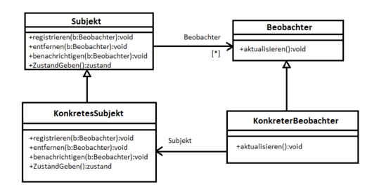
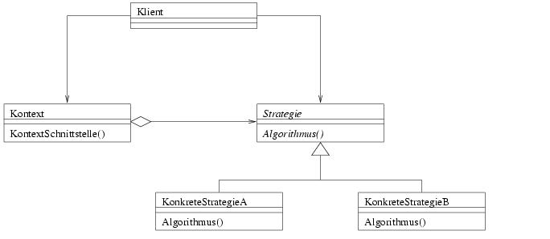
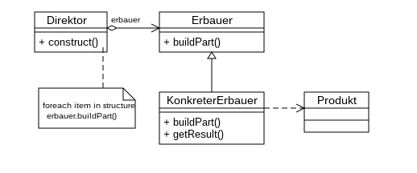
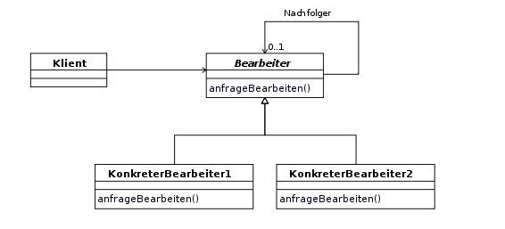
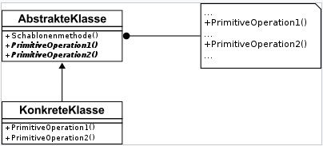
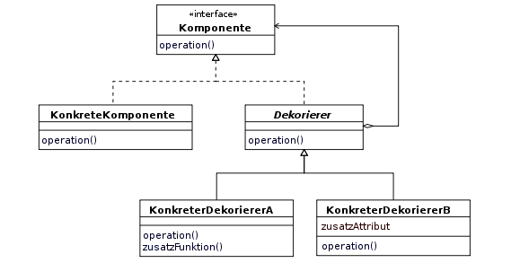
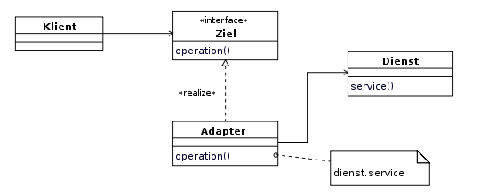

# Entwurfsmuster (Design Patterns)

Entwurfsmuster sind sogenannte "Lösungsschablonen" in der Softwareentwicklung. Bei wiederkehrender Entwurfsproblemen werden sie als Vorlage zu Problemstellung eingesetzt. Ursprünglich kommt der Begriff aus der Architektur. Es gibt verschiedene Typen von Entwurfsmustern. Grundsätzlich gibt es drei große Überbegriffe: 

* Erzeugungsmuster - dienen der Erzeugung von Objekten, gemäß der Regel: "Programmiere auf die Schnittstelle, nicht auf die Implementierung". 
* Strukturmuster - erleichtern den Entwurf von Software durch vorgefertigte Schablonen für Beziehungen zwischen Klassen. 
* Verhaltensmuster - modellieren komplexes Verhalten der Software und erhöhen damit die Flexibilität der Software hinsichtlich ihres Verhaltens. 

## Beobachter (Observer) 

Das Muster Beobachter gehört zur Kategorie der Verhaltensmuster und definiert eine 1-zu-n-Abhängigkeit zwischen Objekten. Es wird benutzt, wenn Daten zentral in einem Subjekt verwaltet werden und mehrere Beobachter darauf Zugriff haben. Das System muss für Konsistenz sorgen, da Aktionen von Beobachtern als auch vom Subjekt ausgelöst werden können. Somit müssen alle Beobachter von der Zustandsänderung informiert werden. 

Das Muster besteht aus den abstrakten Klassen Subjekt und Beobachter. Die Klasse Subjekt hält eine Liste auf *n* Beobachter. Außerdem enthält Beobachter die Methode update(), bei deren Aufruf dem Beobachter signalisiert wird, dass sich das Subjekt geändert hat. Im abstrakten Subjekt gibt es neben Methoden zum An- und Abmelden von Beobachtern (login(Beobachter), logout(Beobachter)) die Methoden broadcast(), die die Beobachter mittels der update()-Methoden informieren.
Da sowohl Subjekt, als auch Beobachter abstrakt sind, muss man bei konkreten Anwendungen natürlich von den beiden Basisklassen ableiten. 



Beispielcode aus dem Youtube Tutorial mit eigenen Kommentaren: [Observer Übung](Observer_Uebung)

## Strategie (Strategy)

Das Muster Strategie ist ein objektbasiertes Verhaltensmuster und definiert eine Familie von Algorithmen, kapselt jeden einzelnen und macht sie austauschbar. Dient dazu, den Algorithmus unabhängig von ihn nutzenden Klienten zu variieren. Somit reduziert man lange if-Bedingungen und Code Duplizierungen. 



Beispielcode aus dem Unterricht: [Strategy Übung](Strategy_Uebung)

## Erbauer (Builder)

Das Builder-Pattern wird genutzt, wenn die Konstruktion eines komplexen Objektes von seiner Repräsentation getrennt werden soll. Das Objekt konstruiert sich nicht selber, sondern wird von einem anderen Objekt erbaut. Da es sich bei den zu konstruierenden Objekten um komplexe Objekte handelt, lässt sich der Konstruktionsprozess oft in mehrere Teilschritte unterteilen. So das derselbe Konstruktionsprozess unterschiedliche Repräsentationen erzeugen kann. Zusätzlich ist anzumerken, dass nur der Builder die Spezifikationen kennt.



Beispielcode aus dem Youtube Tutorial mit eigenen Kommentaren und UML-Diagramm: [Builder Übung](Builder_Uebung)

## Zuständigkeitskette (Chain of Responsibility)

Es hat mehr als ein Objekt die Möglichkeit, eine Anfrage zu erledigen. Verkettet die empfangenen Objekte, und leitet die Anfrage an der Kette entlang, bis ein Objekt sie erledigt.



Es ist möglich die Chain Klasse bzw. Bearbeiter Klasse als abstrakte Klasse oder als Interface zu erstellen. Unterschied ist die Weitergabe der konkreten Bearbeiter in der Kette. In der abstrakten Klasse geschieht es mittels einer Instanzvariablen. Im Interface würde es mittels einer Methode geschehen.

```java
// interface Lösung
public interface Chain {

    public void setNextChain(Chain nextChain);
    ...
}

public static void main(String[] args) {
        Chain chainCalc1 = new AddNumbers();
        Chain chainCalc2 = new SubtractNumbers();
        Chain chainCalc3 = new MultNumbers();
        Chain chainCalc4 = new DivideNumbers();
     
        chainCalc1.setNextChain(chainCalc2);
        chainCalc2.setNextChain(chainCalc3);
        chainCalc3.setNextChain(chainCalc4);
        ...
 }

// Abstrakte Klasse Lösung
public abstract class Chain {
    
    private Chain nextChain;
    
    public Chain(Chain nextChain){
        this.nextChain = nextChain;
    }
    ...
}

public static void main(String[] args){
    Chain chain = new AddNumbers(new SubtractNumbers(new MultNumbers(new DivideNumbers(null))));
    ...
}

```

Beispielcode aus dem Youtube Tutorial mit eigenen Kommentaren: [Chain of Responsibility Übung](Chain_of_Responsibility_Uebung)

## Schablonenmethode (Template Method)

Definiert das Skelett eines Algorithmus in einer Operation und delegiert einzelne Schritte an Unterklassen. Die Verwendung einer Schablonenmethode ermöglicht es Unterklassen, bestimmte Schritte eines Algorithmus zu überschreiben, ohne seine Struktur zu verändern. Es wird den Unterklassen überlassen, das variierende Verhalten zu implementieren. In der Abstrakten Klasse werden primitive Operationen, von konkreten Unterklassen definiert, um die Schritte eines Algorithmus zu implementieren. Sie definiert weiterhin eine Schablonenmethode zur Definition des Algorithmus-Skelettes. Die Konkrete Klasse implementiert die primitiven Operationen, welche die unterklassenspezifischen Schritte des Algorithmus ausführen.



Beispielcode aus dem Youtube Tutorial mit eigenen Kommentaren: [Template Method Übung](Template_Method_Uebung)

## Dekorierer (Decorator)

Erweitert ein Objekt dynamisch um Zuständigkeiten. Dabei werden einzelne Objekte mit mehr Funktionalität erweitert, ohne ihre Klasse zu ändern. Ein flexiblerer Ansatz besteht darin, die Komponente in einem anderen Objekt einzuschließen, das z.B den Rahmen hinzufügt. Das einschließende Objekt heißt Dekorierer. Die Schnittstelle des Dekorierers entspricht der Schnittstelle der dekorierten Komponente, so das seine Anwesenheit für Klienten transparent ist. Diese Transparenz ermöglicht es den Dekorierer rekursiv zu schachteln. Somit kann beliebige und mengenmäßig unbeschränkte Funktionalität hinzugefügt werden.



Beispielcode aus dem Unterricht anhand vom Passwort Manager: [Decorator Übung](Decorator_Uebung)

 ## Adapter

Passt die Schnittstelle einer Klasse an eine andere von ihren Klienten erwartete Schnittstelle an. Es gibt einen Klienten (Main), also der Programmteil der die Klasse mit einer bestimmten Schnittstelle verwendet. Auf der anderen Seite steht eine neue Klasse die zwar die selbe Funktionalität hat, aber eine andere Schnittstelle als die die der Klient bisher verwendet hat. So muß es eine weitere Klasse geben die zwischen ihnen vermittelt. Dies ist die Adapterklasse, die von der bisher verwendeten Klasse abgeleitet wird und als ein neues Attribut ein Objekt der zu adaptierenden Klasse enthält.


